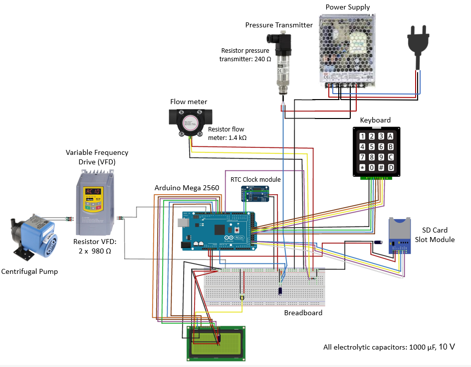

# PumpConstantFlowRate

This repository contains the code for controlling a variable-frequency drive to keep a constant flow rate at the pump outlet. The sensors were directly connected to an Arduino Mega 2560 board integrated with a keypad, an LCD monitor, and an SD memory card to read and save the data instantaneously. 

Finally, a PID controller was implemented in the code to work at the desired constant flow rate during recirculation or in the presence of external variation.  

